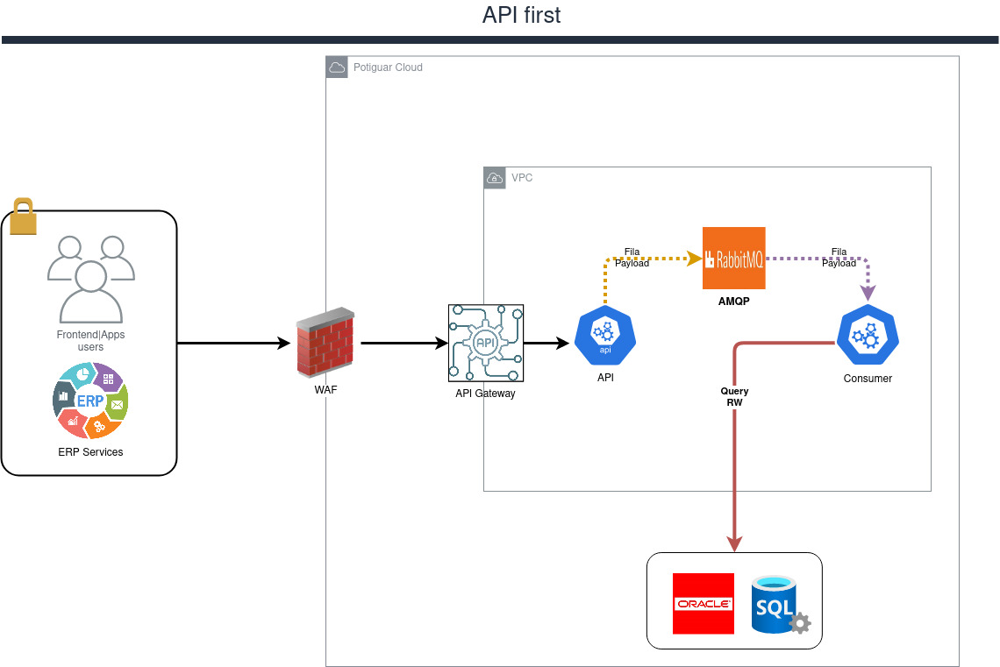

# API CRUD

## Descrição

## ADR(s) relacionada

## Requirements

- Para construir, testar e executar os serviços você precisará:
    - [JDK - 17](https://openjdk.org/install/)
    - [Maven - 3](https://maven.apache.org)
    - [Spring Boot - [3.2.x]](https://spring.io/)
    - [Spring Cloud - [3.2.x]](https://spring.io/)
    - [Intellij](https://www.jetbrains.com/pt-br/idea/)

## Dados sensíveis

- Sim

## Funcionalidades

- Criar, alterar, excluir, consultar e listar registros

## Referência do PO
- 

## Referências técnica
- 

## Referências adicionais
- 

## Envolvidos
- 

## SRE/DEVOPS

> Nota
>> Nunca registre senhas neste documento

- Configuration
    - Porta: 8080
    - Rota: /
    - Facing: Sim
    - Segurança: oauth
    - Dados sensíveis: sim
    - Criticidade
        - Alta
        - Media
        - Baixa **(Sim)**
- Database
    - database
        - tipo: postgres
        - hostname: dns-database
        - username: APP_DATABASE_USER
        - database: APP_DATABASE_NAME
- Queue
    - fila
        - hostname: dns-streaming
        - username: app
        - name: APP_QUEUE_NAME
- S3
    - Bucket
        - hostname: dns-bucket
        - username: app
        - name: APP_BUCKET_NAME
- Observações
  - 

## Arquitetura do micro-service

A abordagem necessita:
> - Uso de mensageiro **AMQP**
>- Uso de banco de dados **oracle**
>- 1 **API** para ingestão dos dados cadastrais
>- 1 **Consumer** para fila **AMQP** e *persistência* dos dados no banco de dados
>- Envio para o callback do dado cadastrado
> ### Fluxograma de arquitetura micro-service

## Notas diversas
- 